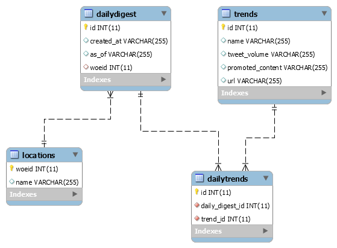

# Twitter Location based Trends Analysis
## Problem Statement
Understand daily trending topics for Canada from twitter data 

## Tasks
- Ingest data from twitter’s public API: https://developer.twitter.com/en/docs/trends/locations-with-trending-topics/api-reference/get-trends-available
- Store raw data for historical purpose into MySQL
- Process data so we get a snapshot of list of trending topics on a given date for Canada.
- Pull data daily while retaining raw data file using Cron Jobs.
- Insert new data to the processed table.
- Store data in MySQL.
- Connect to the data via Power BI.

## Technologies and Packages
- Python 3
- pymysql
- requests
- base64
- json
- MySQL Server
- MySQL OBDC connector
- Power BI for visualizations

## Getting Started

The scripts for scrapping the twitter trends based on location are written in python, these use the twitter authentication key and tokens to register the application. This enables the user to fetch the information from the twitter using API calls to (https://developer.twitter.com/en/docs/trends/locations-with-trending-topics/api-reference/get-trends-available). The data is downloaded into the MySQL database and using the cron jobs used to update the exising trends for Canada. Power BI connects to MySQL for creating the required visulaizations. 

### Prerequisites

- Install Anaconda/ Python 3
- Install the mentioned packages
- Install MySQL from https://dev.mysql.com/downloads/installer/
- Install Power BI from https://powerbi.microsoft.com/en-us/desktop/

# DB Design 

